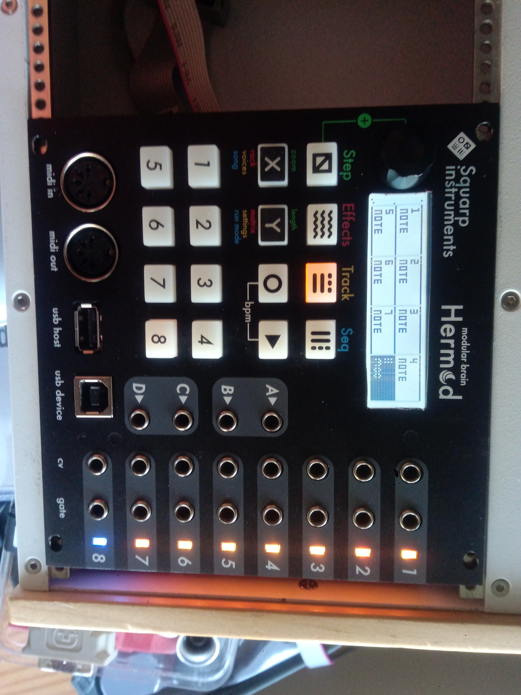
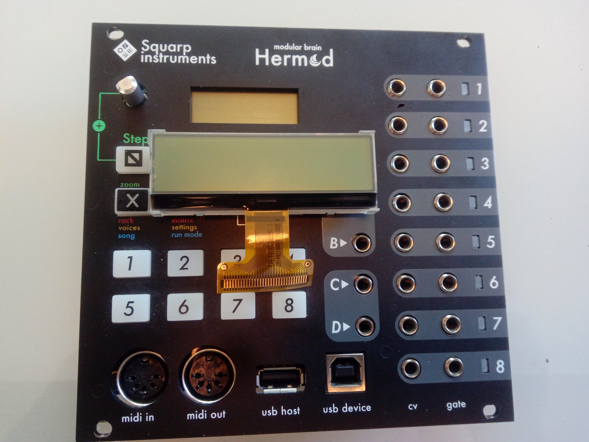
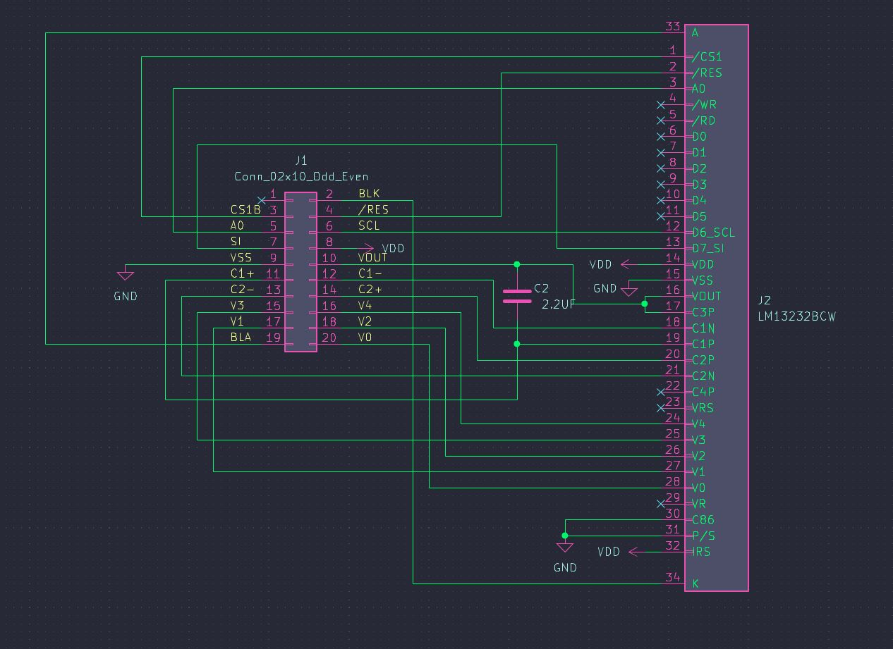
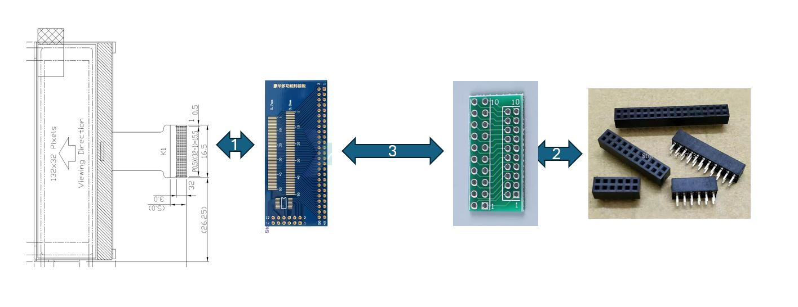
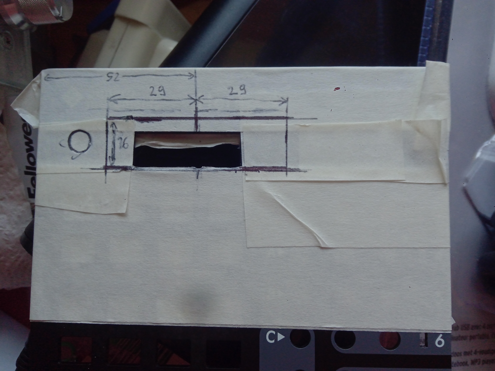
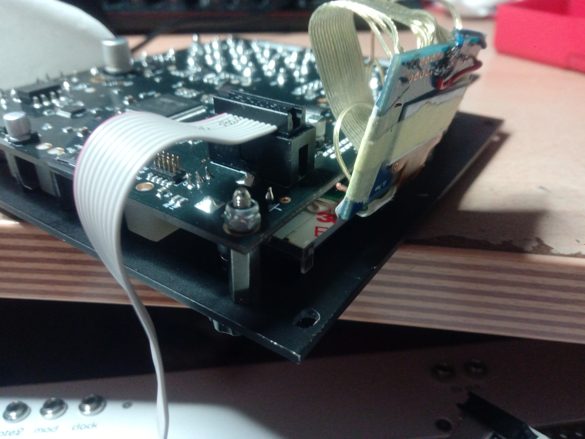

Guide for installing a Topway LM13232BCW‑1 LCD in the Hermod, including wiring and mechanical mods. 
Reasons for doing it:

- your original hermod LCD is faulty (it was my case)
- you want a bigger size (more readable) screen

===================================================================================

⚠️ DISCLAIMER

This display‑upgrade modification does not require any changes to the Hermod PCB, but it does require an irreversible mechanical modification to the Hermod front panel.

By doing this mod, you will:

- Void your Hermod module warranty (if this one was still available)

- Potentially compromise the reselling of your Hermod module on the second hand market! (specially if the cut-out you will make ends being too ugly) 

So do it at your own risks !!!

===================================================================================

So I replaced the original Hermod LCD module using a [Topway LM13232BCW‑1](https://fr.aliexpress.com/item/1005011580661844.html?spm=a2g0o.order_list.order_list_main.5.21ef5e5bzr0rSb&gatewayAdapt=glo2fra) display.

For reference, the LCD originally used on the Hermod module (LCD + PCB + header) was most likely a Newhaven NHD‑C12832A1Z‑FSR‑FBW‑3V3.

🖥️ Display Differences

The Topway display has 132 columns, not 128 like the Newhaven. Since the Hermod firmware only drives 128 horizontal pixels, the first 3 pixels of each line remain unused. They may appear on or off, but it’s not an issue in practice.

Both the original and replacement screens are mounted rotated 180°. the Hermod firmware compensates for this by rotating the display output. → In the end, The flat‑cable side must face upward on the module (not like on the above picture).

🔌 Pinout & Wiring

The pinout and physical layout of the two LCDs are completely different, so all connections must be rewired according to the schematic.

The proper long‑term solution would be to design a new small PCB adapted to the Topway screen.

But for now, I built a working prototype using adapter boards.

🛠️ Steps for the "Prototype Method"

1 — Solder the LCD flat cable

I soldered the LCD’s flex cable onto a [0.7 mm → 2.54 mm FPC adapter](https://fr.aliexpress.com/item/1005003324824895.html?spm=a2g0o.order_list.order_list_main.17.21ef5e5bzr0rSb&gatewayAdapt=glo2fra) using solder paste and flux.

2 — Prepare the 20‑pin header adapter

I soldered a [20‑pin 2.0 mm header connector](https://fr.aliexpress.com/item/4000597517515.html?spm=a2g0o.order_list.order_list_main.23.21ef5e5bzr0rSb&gatewayAdapt=glo2fra) onto a [2.0 mm → 2.54 mm adapter PCB](https://fr.aliexpress.com/item/1005009823719580.html?spm=a2g0o.order_list.order_list_main.11.21ef5e5bzr0rSb&gatewayAdapt=glo2fra), on the bottom side (the side without printed pin numbers).Soldering on the wrong side will invert the pin numbering between the two rows.

Remark: before soldering, I shorten a bit the 20 header solder pins. in such a way that once soldered, the pins do not come out much from the pcb adapter. This will help fitting the lcd at the right place (see step 5 bellow).

3 — Wire both adapters

I wired the two adapter boards together following the KiCad schematic above, including:

a 2.2 µF X7R capacitor

several additional connections not present on the original Hermod LCD module

4 — Modify the front panel

I cut, properly, the front‑panel opening according to this reference picture.

5 — Fit the screen

Space is tight. This LCD assembly is slightly thicker than the original, so I had to shorten a bit the header solder pins to make it fit. A custom PCB (as mentioned above) would solve this cleanly.

The end result of the fitting looks like this (a bit ugly, but once in the case it is not visible  )

I added some insulation tape to make sure there are no short-circuits from exposed solder points to the metallic parts of my modular case

📌 Future Plan

Next time I order PCBs for other things, I’ll probably add a "custom designed" LCD adapter PCB to the batch so this mod can be done properly.
